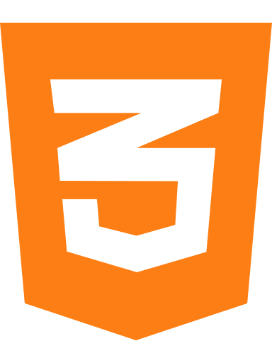

### Ну привет :wave:
### Меня зовут Ринчин. Я фронтенд разработчик.

- :computer: Мне нравится программирование и дизайн
- :green_book: Постоянно учусь и развиваюсь
- :bricks: Хочу работать в крепком коллективе
- :pencil2: В настоящее время работаю над дипломной работой и ищу работу

### Контакты:

email: **rin4in.2015@gmail.com**\
telegram: **@azmorigan**

### Мой стек :rocket::

 

### Статистика:

